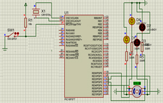

# FuncaoComPassagemDeParametros
O motor será acionado utilizando uma tabela de constante onde estão os valores determinados para acionar 
sequencialmente as bobinas. A tabela utilizada para movimentação nos sentido horário e anti-horário e a 
mesma porem o que muda é a sequencia de envio dos valores. 

